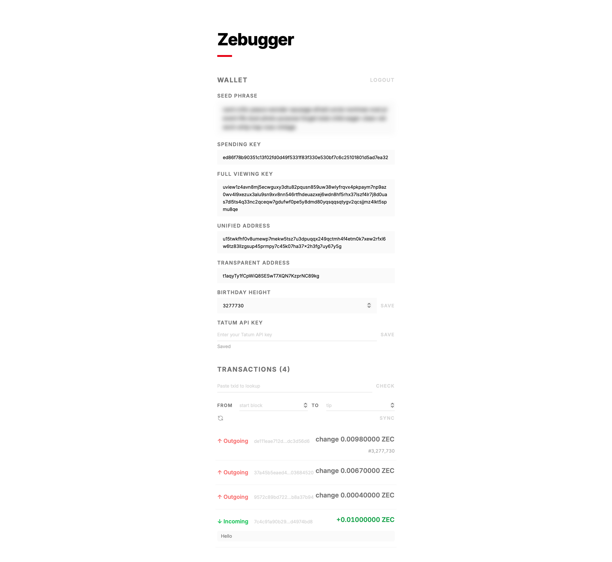

# libjsminizcash

A pure JavaScript/TypeScript Zcash library. Zero native dependencies — runs in Node.js and the browser. Mostly coded with AI.

Currently covers only a few features:

- Wallet generation (BIP-39 mnemonic, Orchard key derivation, unified & transparent addresses)
- Zcash v5 transaction parsing and Orchard note decryption

The end goal is to build a browser-based Zcash wallet that stores the seed phrase inside a passkey (WebAuthn PRF), so there's nothing to back up or manage beyond your device biometrics.

## Zebugger

[Zebugger](https://zebugger-es6.pages.dev) is a quick proof-of-concept web app deployed to Cloudflare Pages, built on this library to help me debug Zcash Orchard transactions more easily. It supports wallet import, block scanning via Tatum RPC, and single transaction lookup with decryption.

## License

MIT
